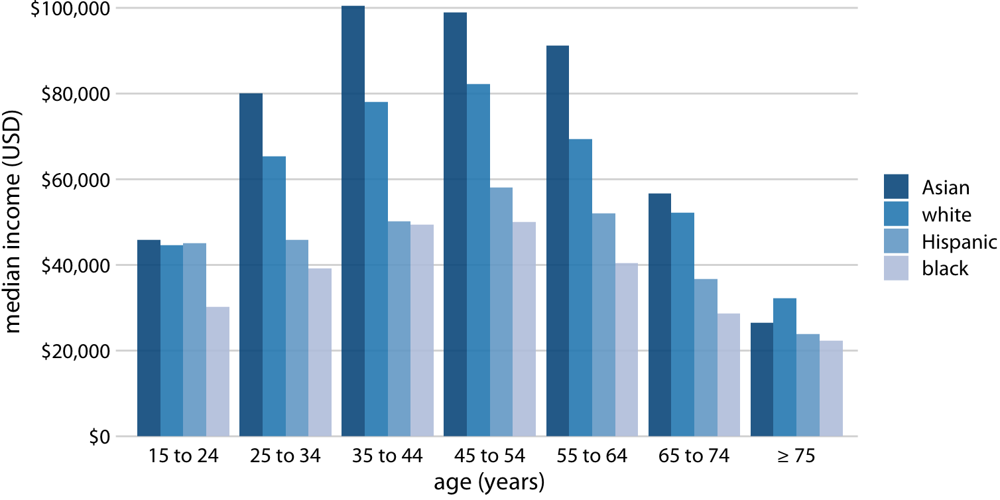
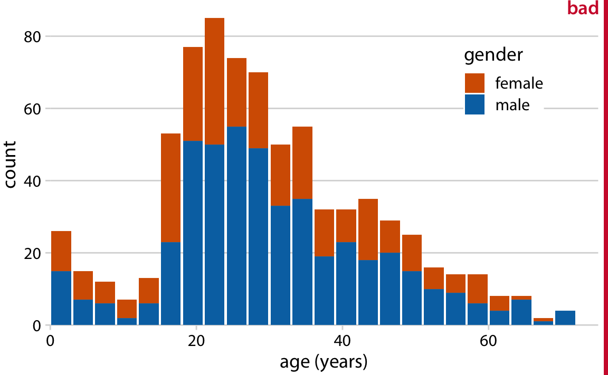

<style type="text/css">
.remark-slide-content {
    font-size: 22px;
    padding: 1em 4em 1em 4em;
}
</style>

```{r setup, include=FALSE}
knitr::opts_chunk$set(echo = F, message = F, warning = F,
                      fig.asp = 9/16,
  fig.align = 'center',
  echo = F,
  out.width = "100%",
  dpi= 300)
```

# Good Visualizations:

## Instant Gratification

* Interpretable with little effort from reader
* Self contained - nothing open to interpretation
* Interesting 
* Simple
  - You will likely be trying to convey 1 idea
  - Complexity comes when showing same figure for multiple subgroups
  - Careful with complexity...could leave to misinterpretation from reader
* It will take many drafts to get the right figure!


---

# Planning a Figure:

## Start with the result

* What result do you want to convey?
    - Think about what kind of figures best convey such result (histogram/barplot/time trend etc)
        - Would this figure be better as a table?
    - Draft out multiple ideas for the figure
    - Can you include interesting subsets in the figure with a slight modification?
* Use your group members!
    - Come up with a sketch of a graph and show to group members
    
---
# Example: Bar Graph (Bad)

```{r}
knitr::include_graphics("graphs/boxoffice-horizontal-bad-order-1.png")
```


---
# Example: Bar Graph (Bad)

## Problems:

* Poor choice of ordering
* Hard to compare groups

## Fix:

* Reorder from highest to lowest
* Easier comparison


---
# Example: Bar Graph (Fixed)

```{r}
knitr::include_graphics("graphs/boxoffice-horizontal-1.png")
```


---
# Example: Bar Graph with Groups

```{r}

```

---
# Example: Bar Graph with Groups

## Problems:

* Difficult to compare across races
* Wants to convey comparisons, but hard on the eye
* Inconsistent capitalization

## Fix:

* "Facet" by race
  - A facet is an individual graph by a subset
  - 4 small figures by race
* This will help convey the message to the reader quicker

---
# Example: Bar Graph with Groups

```{r}

```

---
# Example: Histogram (Bad)

```{r}

```

---
# Example: Histogram (Bad)

## Problems:

* Stacked histograms are easily confused with overlapping histograms!
* Is this a stacked histogram or overlapping
    - Can reach very different conclusions!

## Fix:

* Multiple solutions to fix here, but usually subgroups are best displayed with a facet.

---
# Example: Histogram (Fixed)

```{r}
knitr::include_graphics("graphs/titanic-age-fractional-dens-1.png")
```

---
# Example: Time Trend (Bad)

```{r}
knitr::include_graphics("graphs/bio-preprints-dots-1.png")
```


---
# Example: Time Trend (Bad)

## Problems:

* Difficult for reader to see the trend
* Three different colors overlap with each other
* Reader needs to jump back and forth with the legend

## Fix:

* Connect the dots
* Alternatively, you could facet by group...although this might be a little overkill
* Put the legend on the map
---
# Example: Time Trend (Fixed)

```{r}

```

---
# Example: Proportions (Bad)

```{r}
knitr::include_graphics("graphs/marketshare-pies-1.png")
```

---
# Example: Proportions (Bad)

## Problems:
* Most people say pie charts are the worst form of visualization
    - In my opinion only good when looking at one group
* Poor method when comparing across groups

# Fix:
* Faceting will not work here - the pie chart is bad at these types of comparisons
* Try making a different figure: 
  - Barplot side-by-side faceted by years
  
---
# Example: Proportions (Fixed)

```{r}
knitr::include_graphics("graphs/marketshare-side-by-side-1.png")
```

---
# Summary Statistics Tables

## Good Summary Statistics:
* Self-contained
* For each outcome variable/control variable:
    - Shows the Mean/SD
    - Can possibly show Min/Max/Median if wanted
* Breaks down by interesting sub-groups (if there are any)

---
# Example: Good Summary Stats Table

## Sloan & Hoekstra 2020

* Does Race Matter for Police Use-of-Force?
    - Page 45

## Things this does right:

* Self contained notes
* Interesting sub-samples
* Means/SDs
  - Outcomes
  - Controls

---
# Results Tables

## Good Results Tables:
* Self-contained
* Shows a main result, and possibly interesting sub-group result
* Not overcrowded with unnecessary information
    - You do not need to show all control variables if they are not important
    - Note these in the table note
* Contains notes
  - Notes should have all the necessary information to make the table self-contained


